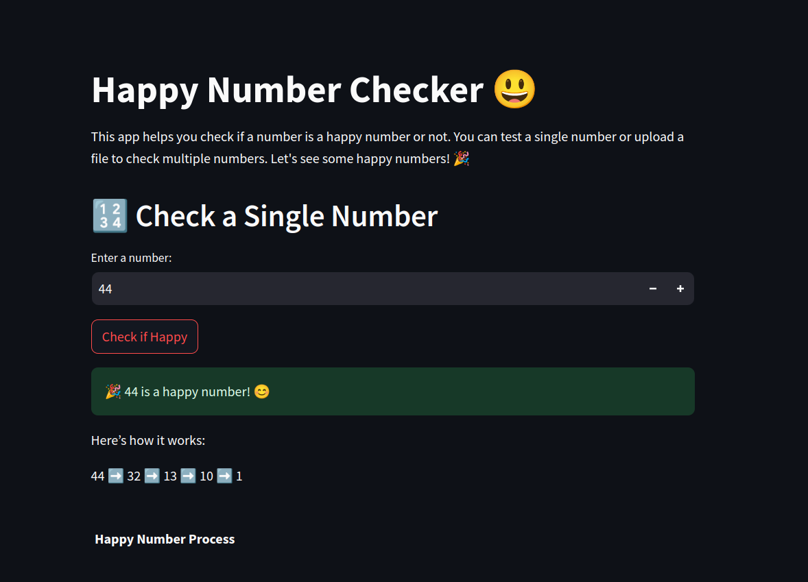
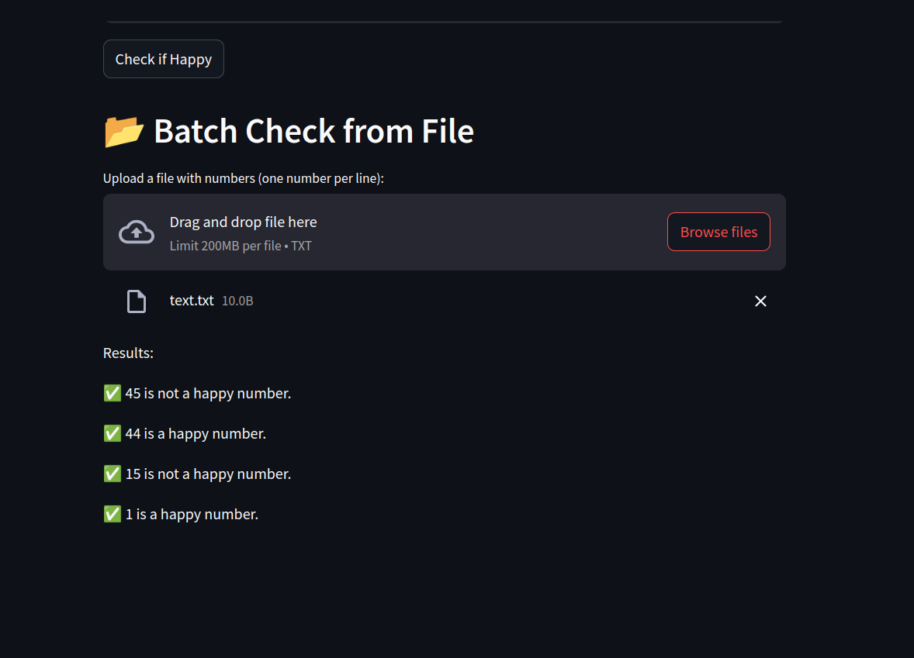

# Happy Number Checker
This project provides two ways to check if a number is a "Happy Number":

1. **Command-Line Interface (CLI):** A Python script that allows you to check individual numbers or process multiple numbers from a file.
2. **Interactive Streamlit App:** A user-friendly web application with a visually appealing interface for checking single numbers or batch processing multiple numbers.

 <br>
<table>
  <tr>
    <td></td>
    <td></td>
  </tr>
</table>

## Features

- Check if a single number is happy.
- Batch processing to check multiple numbers.
- Logging of checked numbers and results.
- Simple web API to check if a number is happy.
- Visualization of the happy number process.

## What is a Happy Number?

A happy number is a number that eventually reaches 1 when replaced repeatedly by the sum of the squares of its digits. If a number does not reach 1, it falls into a loop and is considered an "unhappy" number.

**Example:**

19  is a happy number because:

- 1² + 9² = 82

- 8² + 2² = 68

- 6² + 8² = 100

- 1² + 0² + 0² = 1 (reaches 1, so it’s a happy number)

## Features

- Check if a single number is happy.
- Batch processing to check multiple numbers.
- Logging of checked numbers and results.
- Simple web API to check if a number is happy.
- Visualization of the happy number process.

## Installation

Clone the repository and install the required packages:

```bash
git clone https://github.com/MahtabRanjbar/Happy_number_Detector.git
```
```bash

cd happy-number-detector
```

You will also need to install the required libraries:

```bash
pip install -r requirements.txt

```
## Usage
**1. Running the Command-Line Interface (CLI)**

You can use the happy_number.py script to check happy numbers in two ways:

- Single Number Check:

    Run the script with a number argument:

    ```bash 
    python happy_number.py -n <number>
    ```

 -  Batch Check:

    Prepare a file (e.g., numbers.txt) with one number per line and run: 

    ```bash
    python happy_number.py -f <file_name>
    ```


**2. Running the streamlit app**


The Streamlit app provides a more interactive way to check happy numbers with visualizations.

To launch the app, run:

```bash
streamlit run streamlit_app.py
```

Then, open your web browser and go to http://localhost:8501.

## Running Tests
To run the tests, navigate to the `tests` directory and run:
```bash
pytest
```
## License
This project is licensed under the MIT License.
